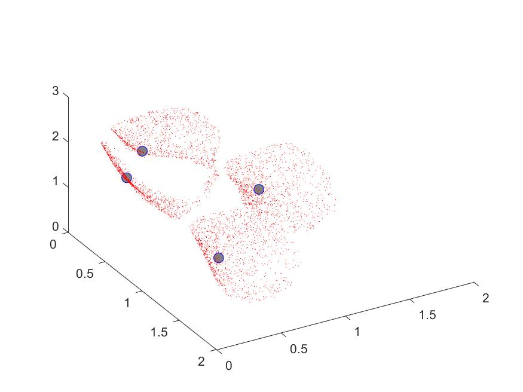
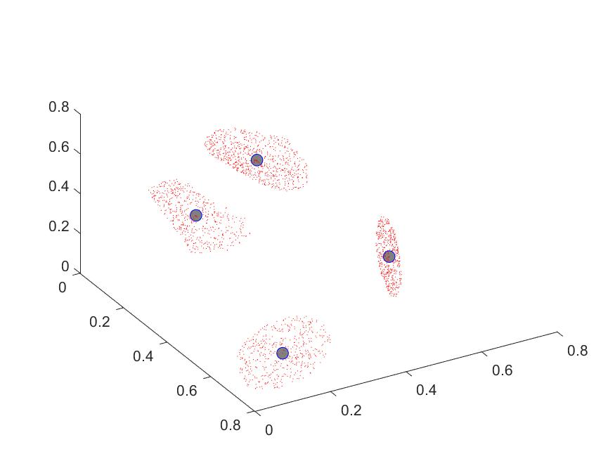

# Knee-Point
Code for "Reinvestigation of evolutionary many-objective optimization: Focus on the Pareto knee front"

# Usage
This code is developed based on PlatEMO v1.6.

# Citation
@article{LI2020193,
title = {Reinvestigation of evolutionary many-objective optimization: Focus on the Pareto knee front},
journal = {Information Sciences},
volume = {522},
pages = {193-213},
year = {2020},
issn = {0020-0255},
doi = {https://doi.org/10.1016/j.ins.2020.03.007},
url = {https://www.sciencedirect.com/science/article/pii/S0020025520301791},
author = {Wenhua Li and Rui Wang and Tao Zhang and Mengjun Ming and Kaiwen Li},
keywords = {Multiobjective optimization, Evolutionary computation, Knee point, NSGA-II, MOEA/D},
}